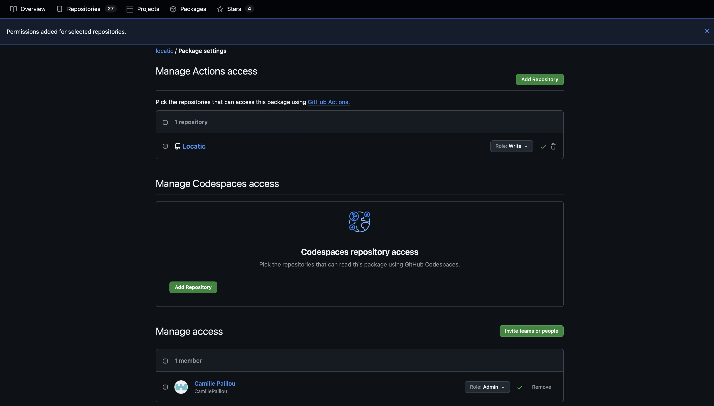
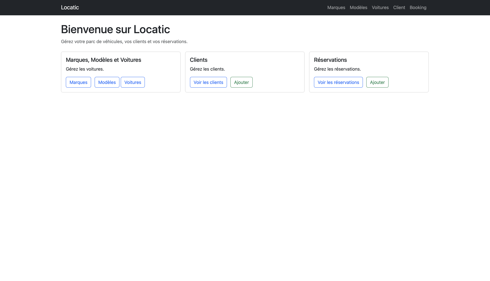
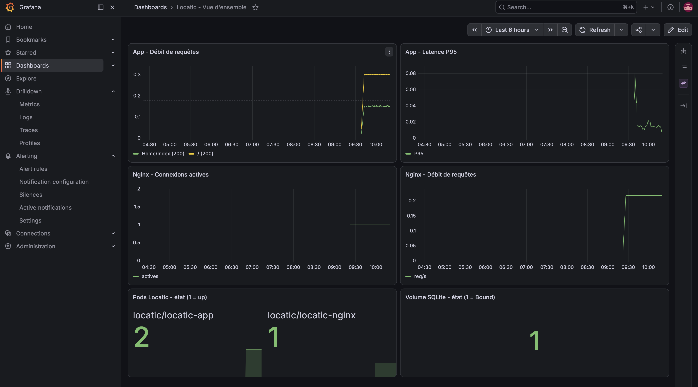

# Preuves d'exécution

## Git / GitHub

- [x] Règle de protection de branche `main` (Settings > Rules), montrant "Require a pull request", les checks obligatoires (`test`, `source-scan`), et le blocage suppression/force-push
- [ ] Une Pull Request fusionnée, avec les checks CI verts


## CI/CD

- [ ] Un run complet du pipeline GitHub Actions vert (les 4 jobs : `test`, `source-scan`, `build`, `publish`)
- [ ] La page du package GHCR `locatic` montrant une image publiée




## Terraform

```bash
cd infra/terraform && terraform apply
kubectl get namespace locatic
kubectl get pvc -n locatic
```


## Ansible

```bash
cd infra/ansible && ansible-playbook -i inventory.yml site.yml -v
```
- [ ] Sortie complète d'une exécution réussie
- [ ] Sortie montrant `changed=0` sur les tâches déjà appliquées (idempotence), et `changed=1` sur une ressource réellement modifiée (voir `docs/ansible.md`)


## Kubernetes

```bash
kubectl get all -n locatic
kubectl get all -n monitoring
```
- [ ] Tous les pods `Running`/`Ready`


## Accès via Nginx

```bash
curl -i http://localhost:8081/
curl -i http://localhost:8081/health/live
curl -i http://localhost:8081/health/ready
```
- [ ] Capture du navigateur montrant l'application accessible via le port-forward Nginx (page d'accueil stylée)




## Persistance SQLite

- [ ] `ls -la /data` avant/après suppression d'un pod applicatif, montrant que `locatic.db` garde la même taille/date


## Monitoring

- [x] Capture de `http://localhost:9090/targets` montrant `locatic/locatic-app` et `locatic/locatic-nginx` en `UP`
- [x] Capture du dashboard Grafana "Locatic - Vue d'ensemble" avec des données réelles sur les 6 panels
- [x] Capture de `http://localhost:9090/alerts` montrant les 3 règles chargées





